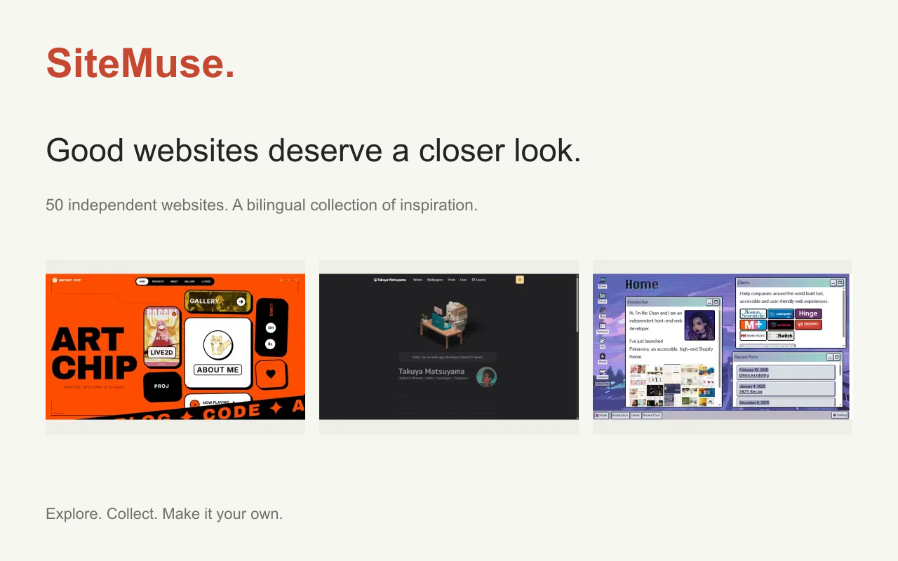

# SiteMuse · 网页灵感馆

中文 | [English](README.en.md)

[在线浏览](https://sitemuse-eight.vercel.app/zh) · [GitHub](https://github.com/DocJlm/sitemuse)

一个中英文双语的独立网站设计参考库。首版精选 50 个个人主页、博客、作品集与创意实验，每个案例包含真实截图、三个设计借鉴点与来源署名。



## 功能

- 杂志式画廊与独立案例页，响应式布局。
- 跨中英文搜索，网站类型与风格多选筛选，URL 保留条件。
- 编辑推荐与最近收录排序。
- 无需登录的浏览器本地收藏；跨语言共享，无法持久保存时保留会话状态。
- `/zh`、`/en` 静态页面，语言关联、分享图与站点地图。

## 本地运行

需要 Node.js 24 和 npm。

```sh
npm ci
npm run dev
```

访问 http://localhost:3000 。

```sh
npm run validate
npm test
npm run build
npm run typecheck
npm start
```

技术栈：Next.js App Router、React、TypeScript、Tailwind CSS。无数据库、管理后台或登录服务。

## 内容维护与发布

案例保存在 `src/data/sites.json`，预览图在 `public/previews/`。阅读 [维护指南](docs/MAINTENANCE.md) 后更新，通过检查再提交；Vercel 与 GitHub 关联后，`main` 分支自动发布生产版本。

生产地址优先读取 `NEXT_PUBLIC_SITE_URL`，否则使用 Vercel 的 `VERCEL_PROJECT_PRODUCTION_URL`。自定义域名时设置前者并重新构建，保证 canonical 和 sitemap 一致。

收藏保存在当前浏览器的 `sitemuse:saved:v1` 中，不上传到服务器；清除浏览器数据会丢失收藏。无跨设备同步。

## 来源与许可

代码采用 [MIT](LICENSE) 许可。**第三方网站截图、商标与原站内容不在本项目 MIT 授权范围内**，相关权利归各自作者所有。截图用于识别、评论和设计参考，来源及核验日期标注在案例页。网站可能在截图后改版。

需要更正署名、链接或移除预览，请在 [GitHub Issues](https://github.com/DocJlm/sitemuse/issues) 联系维护者。字体使用 Geist，许可见 `src/fonts/OFL.txt`。
